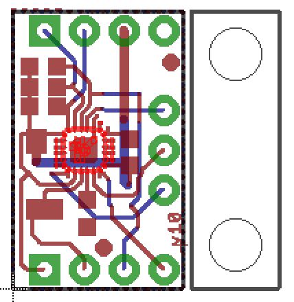

### SparkFun IMU Breakout - MPU-9250
(TODO: after this... use abbreviation.. `SparkFun Board`)

TODO: image licencse check
* Red PCB - SparkFun IMU Breakout - MPU-9250\
Small, Black, Square chip - MPU-9250
* Manufacturer: SparkFun Electronics
* '_Breakout_ board' means a minimal PCB for a single component used for prototyping. [[Link]](https://programmingelectronics.com/what-is-a-breakout-board-for-arduino/) The purpose of a breakout board is to "break out" the leads of a component on separate terminals so that manual connections to them can be made easily. Breakout boards are especially used for surface-mount components or any components with fine lead pitch. [[Link]](https://en.wikipedia.org/wiki/Printed_circuit_board#Overview)
* So this device is just easy-to-use setting of MPU-9250, which is originally SMD and not suitable for fast prototyping.\
As far as I understand, `SparkFun Board` effectively has all functional capability of MPU-9250, with little caution on default jumper setting. (See...)

### MPU-9250

* Manufacturer: InvenSense
* MPU stands for _Motion Processing Units_
* product may used in many smart phone/tablet, Nintenso Wii, Oculus Rift... etc (TODO)\
definitely seems to used in wide range of applications
* from official description [[Link]](https://www.invensense.com/download-pdf/mpu-9250-datasheet/) / and also official Product Specification > 1.3 product overview
    * MPU-9250 consists of two dies integrated into a single QFN package. One die houses the 3-Axis gyroscope and the 3-Axis accelerometer. The other die houses the AK8963 3-Axis magnetometer from Asahi Kasei Microdevices Corporation. Hence, the MPU-9250 is a 9-axis MotionTracking device that combines a 3-axis gyroscope, 3-axis accelerometer, 3-axis magnetometer and a Digital Motion Processor™ (DMP) all in a small 3x3x1mm package available as a pin-compatible upgrade from the MPU-6515.\
    With its dedicated I2C sensor bus, the MPU-9250 directly provides complete 9-axis MotionFusion™ output. The MPU-9250 MotionTracking device, with its 9-axis integration, on-chip MotionFusion™, and runtime calibration firmware, enables manufacturers to eliminate the costly and complex selection, qualification, and system level integration of discrete devices, guaranteeing optimal motion performance for consumers.\
    MPU-9250 is also designed to interface with multiple non-inertial digital sensors, such as pressure sensors, on its auxiliary I²C port.
* MPU-9250 composition
    * Die 1 (TODO: name?? MPU-6500?)
        * 3-Axis gyroscope
        * 3-Axis accelerometer
    * Die 2 - AK8963
        * 3-Axis magnetometer
    * Digital Motion Processor™ (DMP)
    * Temperature Sensor
    * Communication: I2C or SPI
        * TODO: check mag only available in I2C?? or seems mag treated as one of auxiliary sensor device
    

### AK8963

* Manufacturer: Asahi Kasei Microdevices Corporation

